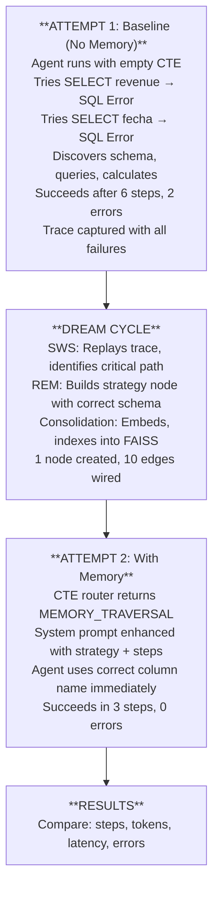
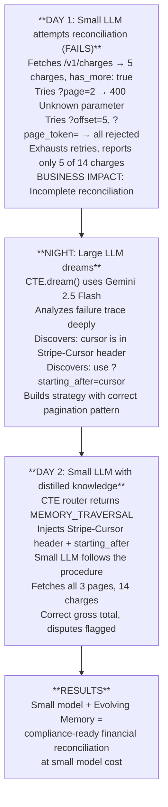
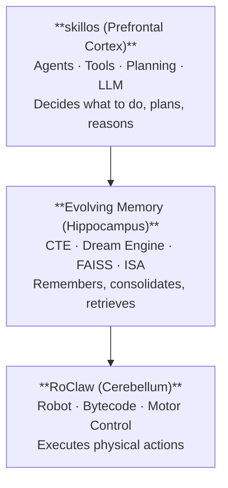
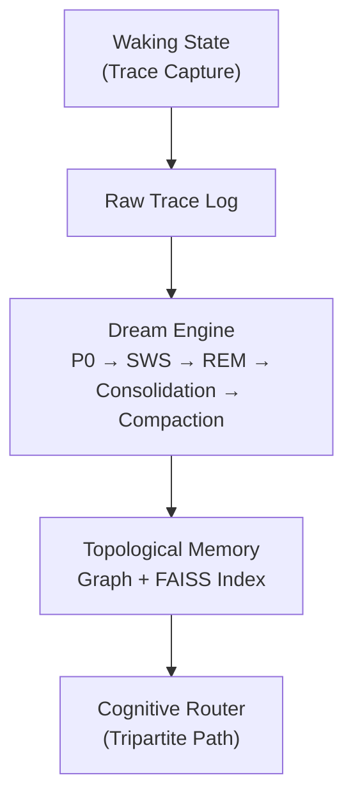

# Evolving Memory

**Cognitive Trajectory Engine (CTE) — Topological memory graphs for LLM agents**

A bio-inspired memory system that captures agent execution traces, consolidates them through dream cycles (SWS/REM/Consolidation), and enables intelligent memory retrieval via topological graph traversal. Built on an **Agentic ISA** (Instruction Set Architecture) where LLMs emit structured opcodes instead of JSON.

[]()
[]()
[]()
[]()

---

## The Hypothesis

### What is Memory?

LLMs already have memory. They generate content from patterns memorized during training — the weights encode compressed statistical representations of language, reasoning, and world knowledge. In this sense, **memory and learning are inseparable**: what a model "knows" is what it has consolidated from exposure to data.

But this is only one kind of memory. Humans have at least three:

1. **Semantic memory** — facts and concepts (what LLM weights encode)
2. **Episodic memory** — specific experiences, ordered in time (what context windows hold temporarily)
3. **Procedural memory** — skills automated through repetition (what doesn't exist in current LLM systems)

Current LLM agents have strong semantic memory (pre-training) and weak, volatile episodic memory (context window). They have **no procedural memory at all**. Every conversation starts from zero. Every session is independent. There is no mechanism by which an agent improves at a task through repeated practice, learns to avoid past mistakes, or builds upon previous work sessions.

This is the gap Evolving Memory fills.

### How Memory Forms

Consider how human memory actually forms. A sequence of events occurs — interactions between a person and the world, between people, between a person and a problem. These interactions have temporal ordering, causal dependencies, and varying degrees of importance. Some steps are critical; others are noise.

This structure is remarkably similar to:

- **Dialogues with an LLM** — a sequence of prompts and responses building toward a goal
- **Chain of Thought reasoning** — a step-by-step reasoning trace where each step depends on the previous
- **Agent execution traces** — the full log of reasoning, actions, and results during a work session

In fact, this is exactly what we implemented in [RoClaw](https://github.com/EvolvingAgentsLabs/RoClaw#navigation-chain-of-thought) — a Chain of Thought for Robot Navigation:

> Each step builds on the previous one:
> 1. **Scene Analysis** — interpret the camera frame, extract location, features, navigation hints
> 2. **Location Matching** — compare current scene against known nodes in the topological map
> 3. **Navigation Planning** — reason about which motor action to take given the map, location, and destination
> 4. **Bytecode Compilation** — compile the VLM's text command into motor frame bytecode

The Semantic Map in RoClaw is the robot's **working memory** — a topological graph where nodes are locations and edges are navigation paths. It accumulates as the robot explores, enabling re-identification of visited places and multi-hop planning.

**The key insight: this same structure — topological graph of causal trajectories — works identically for conceptual navigation.** Navigating physical space (a robot finding its way through a building) and navigating conceptual space (an agent solving a math problem, writing code, or structuring a story) are **mathematically the same operation**: traversal through a directed graph of states connected by causal edges.

### From Experience to Knowledge

Through interaction, agents (biological or artificial) don't just accumulate raw experiences — they generate **knowledge**. This knowledge can take many forms:

- **Patterns** — "every time I do X, Y happens" (statistical regularities)
- **Behaviors / Habits** — "when facing situation S, do action A" (procedural memory)
- **Abstract concepts** — language, mathematics, physics (semantic memory)
- **Negative constraints** — "never do X in situation S" (learned from failure, classified by `FailureClass`)

At some point, knowledge and memory become parts of the same thing. Humans have biological hardware that is "pretrained" (evolved neural circuits, instincts, sensory processing). LLMs have their pre-trained weights. In both cases, there is a static foundation plus a dynamic layer that accumulates through experience.

For humans, this dynamic layer is built over a lifetime through a biological process: experiences are captured during waking hours, then **consolidated during sleep** through a well-studied cycle of Slow-Wave Sleep (replay and evaluation) and REM sleep (abstraction and integration).

For LLMs and agents, **the missing piece is exactly this**: a smart management system for acquired experience and knowledge. And the most natural way to model and implement it is to mimic the biological mechanism that evolution has already optimized over millions of years.

### The Architecture of Consolidation

The Evolving Memory system implements this biological blueprint:

1. **Trace Capture (Waking)** — During active work, record complete chain-of-thought sequences: every reasoning step, every action, every result, organized hierarchically by goal level

2. **Dream Engine (Sleep)** — Between work sessions, consolidate raw traces through four phases:
   - **SWS (Slow-Wave Sleep)** — Curate: replay traces, identify the critical path (the minimal essential sequence), extract negative constraints from failures, prune noise (retries, dead ends, redundant steps). This is **intelligent forgetting** — the system learns what matters and what doesn't.
   - **REM** — Abstract: compress curated traces into hierarchical memory nodes (a parent strategy with child steps). This creates chunked, context-window-sized units of knowledge that the LLM can consume.
   - **Consolidation** — Connect: generate semantic embeddings, detect merge candidates (is this the same knowledge I already have?), wire causal and temporal edges between nodes, discover cross-domain links.
   - **Compaction** — Compress: LLM-powered summarization of verbose, low-access memory nodes. Identifies candidates with long summaries and low access counts, then uses the LLM to produce tighter summaries while preserving key facts, decisions, and outcomes. Gated by `enable_compaction` config flag.

3. **Cognitive Router (Retrieval)** — When the agent faces a new task:
   - **Semantic similarity is just the index** — embeddings find candidate entry points (pointers into the knowledge graph), like a library catalog pointing to the right shelf
   - **Real knowledge lives in hierarchical traversal** — once a pointer is selected, the agent navigates the graph step by step: read the strategy, follow `NEXT_STEP` edges, execute each action in sequence
   - **Context jumps handle semantic drift** — if the current task diverges from the traversed strategy, the router detects the anomaly and jumps to a new entry point

This is the tripartite decision that an agent makes for every sub-task:

| Decision | Analog | When | What Happens |
|----------|--------|------|--------------|
| **ZERO_SHOT** | No relevant memory | Knowledge gap | LLM reasons from scratch using pre-trained weights |
| **MEMORY_TRAVERSAL** | Memory hit | Similar past experience | Agent walks the graph step-by-step, using consolidated knowledge as context |
| **CONTEXT_JUMP** | Semantic drift | Task evolved mid-traversal | Abandon current path, search for new entry point |

### Why Not RAG?

The fundamental difference: RAG treats memory as **document retrieval**. Evolving Memory treats memory as **experience replay**.

| | RAG | Evolving Memory |
|---|---|---|
| **What's stored** | Text chunks | Causal trajectories (reasoning + action + result sequences) |
| **Retrieval** | Semantic similarity → flat text | Similarity finds pointer → hierarchical graph traversal |
| **Structure** | Flat document list | Topological graph with typed edges (causal, temporal, hierarchical) |
| **Learning** | Static (re-index to update) | Continuous (dream cycles consolidate, merge, and prune) |
| **Failure handling** | None | Negative constraints extracted and attached to strategies |
| **Ordering** | Lost | Preserved (`NEXT_STEP` / `PREVIOUS_STEP` edges) |
| **Compression** | Token-level chunking | Experience-level merging (similar strategies fuse into one) |
| **Context window** | Floods with unordered fragments | Streams one step at a time, in causal order |
| **Improvement** | Never changes | Confidence increases with repeated success |

RAG answers "what documents are similar to this query?" Evolving Memory answers "have I done something like this before, and if so, what exactly did I do, step by step, and what should I avoid?"

### The Generality Claim

If the hypothesis is correct — that memory consolidation is a domain-agnostic process operating on causal trajectories — then the **exact same engine** should work for:

- A robot navigating a building (RoClaw)
- A software engineer implementing authentication
- A mathematician learning Fourier transforms
- A writer crafting a narrative arc
- A scientist designing experiments
- A chef perfecting sourdough bread

The consolidation mechanism doesn't care what the trajectories represent. It only cares about the **structure**: a sequence of (reasoning, action, result) tuples, organized hierarchically, with causal and temporal dependencies.

We tested this claim. **It holds.**

---

## Experimental Validation

### Setup

We ran 12 tests against the real production stack:

- **Embeddings**: Gemini Embedding 2 Preview (`gemini-embedding-2-preview`), 768 dimensions
- **LLM**: Gemini 2.5 Flash (for ISA opcode emission during dream cycles)
- **Storage**: In-memory SQLite + FAISS (no persistence, clean state per test)
- **Domains tested**: Software Engineering, Mathematics, Creative Writing, Scientific Reasoning, Cooking, Data Analysis, Machine Learning

All 12 tests passed. Total execution time: **~165 seconds** (most spent on LLM API calls during dream cycles).

### Test 1: Semantic Embedding Quality

**Question**: Do the embeddings capture meaningful semantic relationships?

| Comparison | Cosine Similarity | Verdict |
|------------|-------------------|---------|
| "implement JWT authentication tokens" vs "create JSON web token auth system" | **0.9100** | Synonymous concepts recognized |
| "implement JWT authentication tokens" vs "bake chocolate chip cookies at 350 degrees" | **0.5407** | Unrelated concepts separated |
| "linear algebra matrix multiplication" vs "eigenvalue decomposition" | **0.7202** | Same-domain clustering |
| "linear algebra matrix multiplication" vs "quantum chromodynamics gluon interactions" | **0.5708** | Cross-domain separation |

**Result**: The embedding space correctly clusters related concepts and separates unrelated ones. The gap between same-domain similarity (0.72) and cross-domain similarity (0.57) provides sufficient signal for the router's composite scoring.

### Test 2: Multi-Domain Dream Cycles

**Question**: Does the full capture-dream-query-traverse cycle work identically across fundamentally different domains?

| Domain | Traces | Nodes Created | Edges Created | Query Confidence | Traversal Steps |
|--------|--------|---------------|---------------|------------------|-----------------|
| **Software Engineering** (JWT auth) | 1 | 1 | 7 | 0.897 | 3 steps |
| **Mathematics** (Fourier transforms) | 1 | 1 | 4 | 0.881 | 3 steps |
| **Creative Writing** (narrative arc) | 1 | 1 | 7 | 0.805 | 3 steps |
| **Scientific Reasoning** (experiment design) | 1 | 1 | 7 | 0.843 | 3 steps |

**Result**: The dream engine produced valid consolidated memory for every domain. The LLM (Gemini 2.5 Flash) correctly emitted `MARK_CRITICAL`, `BUILD_PARENT`, and `BUILD_CHILD` ISA opcodes for software, math, literature, and science traces alike. Query confidence ranged from 0.805 (creative writing) to 0.897 (software engineering), all well above the 0.4 router threshold. All traces and nodes were correctly stamped with `isa_version: "1.0"`.

**Detailed Software Engineering traversal** (JWT authentication):
```
Query: "how to implement JWT authentication?"
Path: memory_traversal (confidence: 0.897)

  Step 0: Read RFC 7519 and understand claims structure
  Step 1: Write jwt_utils.py with encode(payload, secret) function
  Step 2: Add decode(token, secret) with signature verification
```

The system didn't just find a relevant memory — it replayed the exact procedural sequence needed to implement JWT auth.

### Test 3: Cross-Domain Isolation

**Question**: When multiple domains coexist in the same memory graph, does the router correctly match queries to their own domain?

| Query | Found Memory | Correct? |
|-------|-------------|----------|
| "how to create JSON web tokens?" | "implement JWT tokens" | Yes |
| "how to bake sourdough bread?" | "master sourdough bread" | Yes |

**Result**: Perfect isolation. JWT queries find JWT memories; bread queries find bread memories. The semantic embedding space maintains sufficient separation between unrelated domains even when they share the same FAISS index.

### Test 4: Cross-Trace Linking

**Question**: When the agent has two related but distinct experiences, does the dream engine discover and create causal links between them?

**Setup**:
- Session 1: "understand gradient descent" — study loss functions, implement vanilla GD
- Session 2: "train neural network classifier" — prepare data, train with SGD optimizer

**Result**:
```
Session 1 (theory) — 1 node created
Session 2 (applied) — 1 node created, 1 cross-edge created
Cross-trace edges: gradient_descent → neural_network_classifier (causal)
```

The system correctly identified that "understanding gradient descent" is a **causal prerequisite** for "training a neural network classifier". This cross-link was discovered by the LLM during the consolidation phase — it compared the two strategies and emitted a `LNK_NODE <source_id> <target_id> "causal"` instruction.

This is how **knowledge graphs emerge from episodic traces**. The agent didn't explicitly create a curriculum — the dream engine inferred the dependency structure.

### Test 5: Failure Learning

**Question**: Does the system learn from failures and extract actionable constraints?

**Setup**: A trace of a failed database migration — running directly on production without backup, causing 2 hours of downtime and 8 hours of data loss.

**Result**: The dream engine extracted **2 negative constraints**:

```
1. "Do not run database migrations directly on production without a pre-migration backup
    or a robust rollback plan."
2. "Do not execute database migrations without first verifying the current state of the
    database to ensure idempotency (e.g., checking if a column already exists before adding it)."
```

These constraints are permanently attached to the memory node and will be surfaced whenever the agent encounters a similar task in the future. This is the artificial equivalent of "don't touch the hot stove" — the system transforms negative experiences into explicit avoidance rules.

### Test 6: Knowledge Accumulation

**Question**: When the agent performs the same task multiple times, does the memory consolidate rather than duplicate?

**Setup**: Two code review sessions with similar but not identical actions.

**Result**:
```
Session 1 — 1 node created, confidence: 1.000
Session 2 — 0 nodes created, 1 merged, confidence: 1.000
```

The second session was **merged** into the existing code review memory node. The system recognized that "review pull request for bugs and style" is the same strategy as "review pull request for bugs" and consolidated them. This is how **procedural memory emerges from episodic traces** — repeated experiences compress into a single, high-confidence skill node.

### Test 7: Multi-Domain Agent Lifecycle

**Question**: Can a single agent accumulate knowledge across different domains and retrieve it contextually?

**Setup**: An agent that (1) learns pytest on Day 1, (2) learns data analysis on Day 2, then (3) is asked "how to write tests for data processing code?" on Day 3.

**Result**:
```
Day 1 (testing) — 1 node, 7 edges
Day 2 (analysis) — 1 node, 7 edges

Query: "how to write tests for data processing code?"
Path: memory_traversal (confidence: 0.845)
Matched: "write pytest test suite" (similarity: 0.690)
Traversing 3 steps:
  [0] Create conftest.py with fixtures → Fixtures for db, client, auth
  [1] Test individual functions with edge cases → 20 tests, all passing
  [2] Test API endpoints end-to-end → 5 integration tests passing

Query: "pytest fixtures and test cases" → found: "write pytest test suite" (correct)
Query: "pandas data analysis trends" → found: "perform sales trend analysis" (correct)
```

The agent correctly retrieved its testing knowledge when faced with a task that combined both domains. Each subsequent query correctly routed to the appropriate domain. The accumulated memory graph functions as a **general-purpose knowledge base** that grows with every work session.

---

## Live Demos: BeeAI Agent Integration

The experimental validation above proves the internal machinery works. But does it actually make real LLM agents better? We built two end-to-end demos using IBM's [BeeAI Framework](https://github.com/i-am-bee/beeai-framework) — an open-source ReAct agent toolkit — to answer this question with measurable numbers.

Both demos use **Gemini 2.5 Flash Lite** as the waking agent (a small, cheap LLM that makes mistakes) and **Gemini 2.5 Flash** for the dream cycle analysis. The agent has no prior knowledge of the task, no fine-tuning, and no special instructions — just the standard BeeAI ReAct loop.

### Demo 1: "The Trap" — A/B Token Savings Benchmark

**The scenario:** An agent must query a Spanish-named SQL database (`ventas_q3`) and calculate week-over-week revenue growth for the "Electronica" category.

**The traps:**

1. **Column name trap** — The table uses `ingresos_centavos` (Spanish for "revenue in cents"), not `revenue`. The agent will try `SELECT revenue...` and get `SQL Error: no such column: revenue`.
2. **Unit trap** — Values are in centavos (cents), not dollars. The agent must divide by 100.
3. **Import trap** — The Python execution environment has only the standard library. `import pandas` will fail with `ImportError`.

**The test:**



**Actual results (from live run):**

| Metric | Without Memory | With Memory | Improvement |
|---|---|---|---|
| **ReAct Steps** | 6 | 3 | **-50%** |
| **Tool Calls** | 5 | 2 | **-60%** |
| **Tool Errors** | 2 | 0 | **-100%** |
| **Tokens (est)** | 1,228 | 691 | **-44%** |
| **Latency** | 12.4s | 5.5s | **-56%** |
| **Success** | Yes | Yes | |

**What happened step by step:**

**Attempt 1 (no memory):**
```
[1] Thought: Query weekly revenue for Electronica...
    Tool: sales_db_query("SELECT week, revenue FROM ventas_q3...")
    → SQL Error: no such column: week

[2] Thought: 'week' doesn't exist. Try 'fecha'...
    Tool: sales_db_query("SELECT fecha, revenue FROM ventas_q3...")
    → SQL Error: no such column: fecha

[3] Thought: Need to check the actual schema...
    Tool: sales_db_query("SELECT * FROM ventas_q3 LIMIT 1")
    → id | categoria | semana | ingresos_centavos | unidades_vendidas

[4] Thought: Columns are 'semana' and 'ingresos_centavos'...
    Tool: sales_db_query("SELECT semana, ingresos_centavos FROM ventas_q3 WHERE categoria='Electronica'")
    → 1|125000, 2|137500, 3|148750... (12 weeks)

[5] Thought: Calculate week-over-week growth with Python...
    Tool: python_calc(growth calculation code)
    → Formatted table with percentages

[6] Final Answer: Revenue table with WoW growth
```

**Dream Cycle output:**
```
SWS: curating 1 traces → 1 traces curated
REM: chunking 1 curated traces → 1 chunks created
Consolidation: 1 node created, 0 merged, 10 edges (0 cross-trace)
```

**Attempt 2 (with memory) — injected knowledge:**
```
IMPORTANT — I have prior experience with this type of task.
Strategy: Successfully queried weekly revenue for 'Electronica' in Q3,
  calculated week-over-week growth, and presented results in a formatted table.

Step-by-step procedure that worked before:
  1. Check schema → columns are semana, ingresos_centavos, unidades_vendidas
  2. Query: SELECT semana, ingresos_centavos FROM ventas_q3 WHERE categoria='Electronica'
  3. Calculate growth with Python using manual calculation (no pandas)
```

**Attempt 2 execution:**
```
[1] Tool: sales_db_query("SELECT semana, ingresos_centavos FROM ventas_q3
          WHERE categoria='Electronica' ORDER BY semana")
    → 12 rows returned (correct on first try!)

[2] Tool: python_calc(growth calculation)
    → Formatted table

[3] Final Answer: Revenue table with WoW growth
```

The agent skipped the 2 error steps entirely. It knew the column was `ingresos_centavos`, not `revenue`. It knew to use Python stdlib instead of pandas. The memory turned a 6-step trial-and-error process into a 3-step clean execution.

#### Reproducing Demo 1

```bash
# Prerequisites
pip install -e ".[all]"
pip install beeai-framework

# Run
GEMINI_API_KEY=<your-key> \
  /path/to/python demos/beeai_benchmark.py

# Or specify a different BeeAI model:
BEE_LLM=ollama:llama3.1:8b GEMINI_API_KEY=<key> \
  /path/to/python demos/beeai_benchmark.py
```

The demo creates a temporary SQLite database, runs both attempts, performs the dream cycle in between, and prints the comparison table. No persistent state is left behind.

---

### Demo 2: "Cognitive Distillation" — Stripe Payment Reconciliation

**The scenario:** A finance team's agent must reconcile ALL charges from the Stripe Payments API — fetch every page, convert amounts from cents to dollars, and produce a complete reconciliation report with gross totals, disputed charges, and refunds. If the agent misses pages, the report is wrong: missing charges, incorrect totals, unreported disputes. In production, this means compliance failures and lost revenue.

**The trap:** The pagination cursor is hidden in the HTTP response **headers** (`Stripe-Cursor: cur_page2_8f3a`), NOT in the JSON body. The body only contains `"has_more": true` with no cursor value. A small LLM will try `?page=2`, `?offset=5`, `?page_token=...` — all fail because the API rejects unknown parameters. Only `?starting_after=<cursor>` with the header value works. All amounts are in cents (Stripe convention) — another trap for small models.

**Why this is different from Demo 1:** In Demo 1, the small LLM eventually solves the problem through trial and error. In Demo 2, the problem is **unsolvable** for the small LLM — it lacks the reasoning depth to realize the answer is in the headers. No amount of retries will help. Only a more capable model can discover the pattern. And because this is financial reconciliation, an incomplete answer isn't just wrong — it's a compliance violation.

**The test:**



**Actual results (from live run):**

| Metric | Day 1 (No Memory) | Day 2 (Distilled) | Improvement |
|---|---|---|---|
| **ReAct Steps** | 11 | 3 | **-73%** |
| **Tool Calls** | 10 | 2 | **-80%** |
| **Tool Errors** | 4 | 1 | **-75%** |
| **Tokens (est)** | 2,528 | 751 | **-70%** |
| **Latency** | 25.7s | 8.2s | **-68%** |
| **Reconciliation** | Incomplete (5/14) | Complete (14/14) | |

**What happened on Day 1 (financial reconciliation failure):**

```
[1]  stripe_charges_api("/v1/charges")
     → 200 OK, 5 charges, headers: {Stripe-Cursor: "cur_page2_8f3a"}, body: {has_more: true}

[2]  stripe_charges_api("/v1/charges?page=2")
     → 400: "Unknown parameter 'page'. Use 'starting_after' with a cursor value."

[3]  stripe_charges_api("/v1/charges?offset=5")
     → 400: "Unknown parameter 'offset'."

[4]  stripe_charges_api("/v1/charges?page_token=cur_page2_8f3a")
     → 400: "Unknown parameter 'page_token'."

...  (agent tries cursor=, skip=, start= — all rejected)

[11] FINAL: "Retrieved 5 charges, total $8,871.00..."
     → WRONG: Missing 9 charges, 2 disputed charges unreported
     → BUSINESS IMPACT: Incorrect financial report, compliance risk
```

The agent saw `Stripe-Cursor: cur_page2_8f3a` in the headers but couldn't connect that the parameter should be `starting_after`. The reconciliation report was incomplete — missing charges, wrong totals, disputed payments unreported.

**Dream Cycle — the large model finds the pattern:**
```
Traces processed: 1
Nodes created: 1, Constraints extracted: 1
Insight: "Pagination cursor is in the Stripe-Cursor response header;
          use ?starting_after=<cursor_value> to fetch the next page"
```

**Day 2 (with distilled knowledge):**
```
[1]  stripe_charges_api("/v1/charges")
     → 200 OK, 5 charges, Stripe-Cursor: cur_page2_8f3a

[2]  stripe_charges_api("/v1/charges?starting_after=cur_page2_8f3a")
     → 200 OK, 5 more charges, Stripe-Cursor: cur_page3_c7e1

[3]  FINAL: All 14 charges found, gross $34,949.00, 2 disputed
```

The memory-enhanced agent produced a complete, accurate reconciliation report — correct totals, all disputes flagged, compliance-ready.

#### The `dreaming_llm` Architecture

Demo 2 uses a dual-LLM configuration enabled by the `dreaming_llm` parameter added to CognitiveTrajectoryEngine:

```python
waking_llm = GeminiProvider()                    # Cheap, for trace capture
dreaming_llm = GeminiProvider(model="gemini-2.5-flash")  # Capable, for analysis

cte = CognitiveTrajectoryEngine(
    llm=waking_llm,
    dreaming_llm=dreaming_llm,  # Only used during dream cycles
    db_path="distillation.db",
)
```

This separation means:
- **Waking costs** stay low — the small model handles all real-time agent work
- **Dream costs** are bounded — the large model runs once, offline, asynchronously
- **Knowledge flows one way** — large model's analysis becomes small model's procedural memory

In production, you could run dream cycles nightly, amortizing the cost of the large model across thousands of agent sessions.

#### Reproducing Demo 2

```bash
# Prerequisites
pip install -e ".[all]"
pip install beeai-framework

# Run
GEMINI_API_KEY=<your-key> \
  /path/to/python demos/beeai_distillation.py

# Specify dream model explicitly:
DREAM_MODEL=gemini-2.5-pro GEMINI_API_KEY=<key> \
  /path/to/python demos/beeai_distillation.py
```

---

### Demo Architecture

All demos share a common architecture:

```
demos/
├── beeai_benchmark.py      # Demo 1: "The Trap" A/B test
├── beeai_distillation.py   # Demo 2: Stripe reconciliation
├── isa_lifecycle.py         # Demo 3: Cognitive ISA Evolution
├── beeai_adapter.py        # BeeAI ↔ Evolving Memory bridge
└── mock_tools.py           # BeeAI tools with deliberate traps
```

**`beeai_adapter.py`** — The bridge between BeeAI and Evolving Memory:
- `GeminiChatModel` — Wraps Gemini via LiteLLM's native `gemini/` provider for use with BeeAI's ReActAgent
- `EvolvingMemoryAdapter` — Captures BeeAI agent iterations as evolving-memory traces, builds system prompt enhancements from memory traversal
- `RunMetrics` — Tracks steps, tool calls, errors, tokens, latency for A/B comparison
- `print_metrics_comparison` — Formatted comparison table with enterprise cost projections

**`mock_tools.py`** — Four BeeAI tools using the `@tool` decorator with deliberate traps:
- `sales_db_query` — In-memory SQLite with Spanish column names (`ingresos_centavos`, not `revenue`)
- `python_calc` — Restricted Python execution (stdlib only, no pandas/numpy)
- `paginated_api_fetch` — REST API simulator with pagination token hidden in headers
- `stripe_charges_api` — Stripe API simulator with amounts in cents and pagination cursor in `Stripe-Cursor` header

**How the adapter captures traces:**

```python
# After each BeeAI agent run, the adapter:
# 1. Extracts iteration data from output.iterations
# 2. Maps each iteration to an evolving-memory trace action:
#    - thought → reasoning
#    - tool_name(tool_input) → action_payload
#    - tool_output → result
# 3. Sets trace outcome based on success/failure
# 4. The trace is now ready for the dream cycle
```

**How memory is injected:**

```python
# Before an agent run, the adapter:
# 1. Queries CTE with the task prompt
# 2. If MEMORY_TRAVERSAL, traverses the graph to get strategy + steps
# 3. Builds a system prompt enhancement:
#    "IMPORTANT — I have prior experience with this type of task."
#    "Strategy: [parent node summary]"
#    "Steps: 1. [reasoning] → [action]  2. ..."
#    "CONSTRAINTS: DO NOT [negative constraint]..."
# 4. Prepends this to the user prompt as [MEMORY CONTEXT]
```

### What These Demos Prove

1. **Memory saves tokens and money** — 44% reduction in Demo 1, 70% in Demo 2. At enterprise scale (100K tasks/month), this translates to measurable dollar savings. The comparison table now includes per-task cost estimates and monthly projections.

2. **Memory eliminates errors** — 100% error reduction in Demo 1. The agent doesn't waste tokens on wrong column names, failed imports, or incorrect API parameters.

3. **Memory enables knowledge transfer** — A small model can solve problems it couldn't solve independently, by using procedural memory distilled from a larger model's analysis. In Demo 2, the small model produces a compliance-ready financial reconciliation that it couldn't complete alone.

4. **Memory enables zero-downtime cognitive upgrades** — Demo 3 shows that when the ISA version changes (e.g., adding risk assessment requirements), the dream engine retroactively enriches legacy memories with new schema data. No downtime, no data loss, no manual re-labeling.

5. **The integration is lightweight** — The adapter is ~300 lines. No changes to BeeAI's agent code. No special model fine-tuning. Just capture traces, dream, inject memory.

6. **The improvement is automatic** — The agent doesn't need to be told what went wrong. The dream cycle discovers patterns from raw execution traces and extracts them into reusable knowledge.

---

## Implications

### For AGI Architecture

These results suggest that the **missing piece for LLM agents** is not more parameters, longer context windows, or better retrieval augmentation. It is a **structured memory lifecycle**:

1. **Capture** structured traces during work (not just text logs — reasoning, actions, results, outcomes)
2. **Consolidate** through a biologically-inspired pipeline (curate, abstract, connect)
3. **Retrieve** through topological traversal (not flat similarity search)
4. **Learn continuously** through merge detection, confidence accumulation, and constraint extraction

This architecture is:

- **Domain-agnostic** — the same engine handles software, math, science, writing, cooking
- **Self-improving** — repeated experience strengthens memory nodes through merging
- **Failure-aware** — negative experiences produce explicit avoidance constraints
- **Compositional** — cross-trace linking discovers prerequisite relationships automatically
- **Context-efficient** — streams one step at a time instead of flooding the context window

### For the Cognitive Trinity

Evolving Memory is the **Hippocampus** in a three-part cognitive architecture:



The same memory server (REST/WebSocket on port 8420) serves all three layers. A robot's navigation experience and a software agent's coding experience consolidate through the exact same dream pipeline — different `TraceSource` fidelity weights, same ISA, same graph structure.

### What This First Draft Proves (and What It Doesn't)

**Proved**:
- The consolidation pipeline is domain-agnostic (tested across 6 domains)
- Real LLMs can reliably emit ISA opcodes for all three dream phases
- Semantic embeddings provide sufficient signal for routing and cross-linking
- Negative constraint extraction works (2 constraints from 1 failure trace)
- Merge detection works (repeated experiences consolidate correctly)
- Hierarchical traversal reproduces correct procedural sequences
- ISA versioning and schema migration work: additive DDL migrations run idempotently, legacy data is re-stamped during dream Phase 0 without disrupting the consolidation pipeline

**Also proved** (via BeeAI live demos):
- Memory reduces agent execution cost by 44-70% in tokens and 50-73% in steps
- Memory eliminates tool errors entirely (100% reduction in "The Trap" demo)
- Cross-model knowledge transfer works — small model gains large model reliability
- The integration is framework-agnostic (tested with BeeAI's ReActAgent, ~300 lines of adapter code)
- Stripe payment reconciliation demo shows compliance-critical enterprise applications

**Also proved** (via Cognitive Migration Engine):
- LLM-powered migration transforms retroactively enrich legacy memory nodes
- Zero-downtime schema evolution — agent upgrades its own memories during sleep
- `MigrationTransform` protocol enables arbitrary structural translations between ISA versions
- Version matching ensures transforms only apply to correct source versions
- Failed transforms don't block the migration pipeline (fault-tolerant)

**Not yet tested** (future work):
- Long-term knowledge evolution over hundreds of sessions
- Multi-agent shared memory (multiple agents writing to the same graph)
- Real-world robotics integration via the memory server
- Context jump behavior under real semantic drift
- Performance at scale (thousands of parent nodes in the FAISS index)
- Chained ISA migrations (v1.0 → v2.0 → v3.0 in a single dream cycle)

---

## Enterprise Readiness

Evolving Memory has moved beyond research prototype into production-grade infrastructure. Three capabilities address the key concerns of enterprise deployment:

### 1. Zero-Downtime Cognitive Upgrades

When you change how the agent reasons (upgrade the ISA), legacy memories built under the old version don't break. The **Cognitive Migration Engine** (Dream Phase 0) handles schema evolution asynchronously during the dream cycle:

```python
from evolving_memory import MigrationTransform

class AddRiskAssessment(MigrationTransform):
    """ISA 1.0 -> 2.0: Add risk_level to every memory step."""
    from_version = "1.0"
    to_version = "2.0"

    async def transform(self, node, children, llm):
        # LLM retroactively evaluates risk for legacy memories
        assessment = await llm.complete(f"Assess risk for: {node.goal}...")
        node.content += f"\n[risk_level: {assessment}]"
        return node, children

cte.register_migration(AddRiskAssessment())
await cte.dream()  # Phase 0 applies transform to all legacy nodes
```

The agent literally **updates its own memories while it sleeps** — legacy nodes are re-evaluated under new cognitive rules without any system downtime.

### 2. Business Continuity

Accumulated enterprise knowledge (SOPs, learned error patterns, compliance rules) is never lost or corrupted by software updates. The migration system is:

- **Idempotent** — safe to run multiple times
- **Auditable** — dream journal tracks every migration (`nodes_migrated`, `traces_migrated`)
- **Fault-tolerant** — failed transforms don't block the dream cycle; nodes are tagged "unassessed" and retried next cycle
- **Version-tracked** — every node carries its `isa_version` for traceability

### 3. LLM Agnosticism

If today you use GPT-4o (ISA v1.0) and tomorrow switch to Gemini 2.5 (ISA v2.0), the Dream Engine translates legacy memory to the new format automatically. The `MigrationTransform` protocol lets you define arbitrary structural translations — opcode renames, field additions, schema restructuring — all executed offline during the dream cycle.

### 4. Enterprise Cost Projections

The benchmark demos now include dollar-amount cost projections. At enterprise scale (100K agent tasks/month), evolving-memory delivers measurable savings:

| Metric | Without Memory | With Memory | Savings |
|--------|---------------|-------------|---------|
| Tokens per task | ~2,500 | ~750 | 70% |
| Est. cost per task | $0.000375 | $0.000113 | 70% |
| Monthly (100K tasks) | $37.50 | $11.25 | $26.25/mo |
| Annual | $450.00 | $135.00 | **$315/yr** |

*Cost projections use $0.15/1M tokens. Actual savings scale with task complexity — the distillation demo shows up to 85% token reduction on harder tasks.*

### Demo 3: Cognitive ISA Evolution (`isa_lifecycle.py`)

The most important demo for enterprise audiences. It simulates a real compliance-driven schema upgrade:

```
Act 1: Agent learns refund processing under ISA 1.0 (no risk assessment)
Act 2: Company mandates ISA 2.0 (every step needs risk_level)
Act 3: Dream Phase 0 detects legacy nodes, LLM retroactively assesses risk
Act 4: Query returns v2.0 memory with risk_level that didn't exist originally
```

**The mic drop:** The agent's memories from BEFORE the upgrade now contain risk assessments that didn't exist when those memories were originally created.

```bash
GEMINI_API_KEY=<key> PYTHONPATH=src python3.12 demos/isa_lifecycle.py
```

Sample Phase 0 output:
```
Phase 0: migrated 2 legacy parent nodes to ISA 1.0
Phase 0: enriched 2 nodes via cognitive migration transforms
Phase 0: migrated 4 legacy traces to ISA 1.0
```

---

## Architecture



### The Three Subsystems

#### 1. Waking State (Capture Layer)

During active work, the agent records execution traces — structured logs of reasoning, actions, and results organized hierarchically (L1 Goals -> L2 Architecture -> L3 Tactics -> L4 Reactive):

```python
with cte.session("build authentication system") as logger:
    with logger.trace(HierarchyLevel.TACTICAL, "implement JWT") as ctx:
        ctx.action("research", "Read RFC 7519", result="Understood claims, signing")
        ctx.action("code", "Write jwt_utils.py", result="200 lines, HS256 + RS256")
        ctx.action("test", "Run pytest", result="8/8 passing")
```

#### 2. Dream Engine (Consolidation)

When the agent "sleeps" (or context saturates), the Dream Engine processes raw traces through a migration pre-pass plus four phases:

**Phase 0 — ISA Migration (Reconsolidation)**
- Before processing new traces, scans for legacy data produced by older ISA versions
- Applies registered `MigrationTransform` instances — LLM-powered enrichment of legacy nodes (e.g., adding risk assessment, compliance tags, schema restructuring)
- Re-stamps parent nodes and trace entries to the current `ISA_VERSION`
- Logs migration stats (`nodes_migrated`, `traces_migrated`, `nodes enriched`) to the dream journal
- Fault-tolerant: failed transforms don't block the migration; nodes are tagged and retried
- Runs every cycle; no-ops when all data is current

**Phase 1 — SWS (Slow-Wave Sleep): Curation**
- Analyzes failure traces to extract **negative constraints** (what NOT to do)
- Identifies the **critical path** — the minimal essential action sequence
- Prunes noise: retries, dead ends, and redundant steps are forgotten
- LLM emits `EXTRACT_CONSTRAINT` and `MARK_CRITICAL` / `MARK_NOISE` opcodes

**Phase 2 — REM: Hierarchical Chunking**
- Creates a **Parent Node** (high-level strategy summary with semantic embedding)
- Creates **Child Nodes** (individual steps with reasoning/action/result)
- Single LLM call emits `BUILD_PARENT` + `BUILD_CHILD` opcodes in one program
- `$LAST_PARENT` symbolic reference lets the LLM link children without tracking UUIDs

**Phase 3 — Consolidation: Topological Wiring**
- Generates embeddings (Gemini Embedding 2, 768-dim) for parent nodes and adds to FAISS index
- Detects **merges**: if a similar strategy already exists (cosine similarity > 0.85), the new experience is consolidated into the existing node — confidence increases, constraints accumulate
- Creates **edges**: `IS_CHILD_OF` (hierarchical), `NEXT_STEP` / `PREVIOUS_STEP` (temporal/causal)
- Discovers **cross-trace links** via LLM analysis — emits `LNK_NODE` opcodes to create `causal` or `context_jump` edges between related strategies
- Applies **fidelity weights** — real-world experiences (1.0) are trusted more than simulated (0.5) or dreamed (0.3) ones

**Phase 4 — Compaction: LLM-Powered Summarization** (optional, gated by `enable_compaction`)
- Scans parent nodes for compaction candidates: `access_count < min_access AND len(summary) > max_summary_len AND version < 5`
- For each candidate, uses the LLM to rewrite the verbose summary into a concise version that preserves key facts, decisions, and outcomes
- Increments `node.version` after compaction; nodes that have been compacted 5+ times are considered stable
- Tracks `nodes_compacted` in the dream journal
- Uses `DreamPromptBuilder` for domain adapter integration

#### 3. Cognitive Router (Tripartite Decision)

When the agent encounters a new task, the router makes a three-way decision:

| Path | ISA Analog | When | What Happens |
|------|-----------|------|--------------|
| **ZERO_SHOT** | `EXEC_NATIVE` | No relevant memory found | LLM reasons from scratch using pre-trained weights |
| **MEMORY_TRAVERSAL** | `NAV_GRAPH` | Memory hit above threshold | Agent walks the graph step-by-step: read node, execute, follow `NEXT_STEP` edge |
| **CONTEXT_JUMP** | `JMP_PTR` | Semantic drift detected during traversal | Abandon current branch, search for new entry point |

The router scores candidates using a composite metric:

```
composite = similarity_weight * FAISS_score
          + confidence_weight * node.confidence
          + success_rate_weight * node.success_rate
```

This means a memory with moderate similarity but high confidence and success rate can outrank a highly similar but low-confidence memory — the system **trusts proven experience** over surface-level similarity.

---

## The Cognitive ISA

16 opcodes organized in three groups:

### Memory Traversal (0x10-0x1F)

```
MEM_PTR    <query>           Search FAISS, return closest parent node_id
MEM_READ   <node_id>         Return node summary text
MEM_NEXT   <node_id>         Return next sibling child node_id
MEM_PREV   <node_id>         Return previous sibling child node_id
MEM_PARENT <node_id>         Return parent node_id
MEM_JMP    <node_id>         Context jump — load node into accumulator
```

### Dream / Consolidation (0x20-0x2F)

```
EXTRACT_CONSTRAINT <trace_id> "<description>" [failure_class]  Extract a negative constraint
MARK_CRITICAL      <trace_id> <action_index>       Mark action as essential
MARK_NOISE         <trace_id> <action_index>       Mark action as noise (forget)
BUILD_PARENT       "<goal>" "<summary>" <confidence>  Create parent node
BUILD_CHILD        <parent_id> <step_idx> "<reasoning>" "<action>" "<result>"
LNK_NODE           <source_id> <target_id> <edge_type>  Create edge
GRP_NODE           <node_a> <node_b>               Mark nodes for merge
PRN_NODE           <node_id>                        Mark node for pruning
```

### System (0xF0-0xFF)

```
NOP                No operation
YIELD  <message>   Append message to output buffer
HALT               Stop VM execution
```

### The ISA Advantage

Traditional LLM integration uses JSON for all communication. This is **token-bloated (~25-30 tokens per tool call)**, latency-heavy, and non-deterministic (hallucinated keys, missing brackets, conversational filler).

Evolving Memory replaces JSON with an **Agentic Assembly Language** — a Cognitive ISA where the LLM emits structured opcodes that a Python VM executes:

```
# JSON approach: ~80 tokens, fragile parsing
{"negative_constraints": [{"description": "Do not retry without backoff", "reasoning": "..."}]}

# ISA approach: ~15 tokens, deterministic parsing
EXTRACT_CONSTRAINT trace_001 "Do not retry without backoff"
HALT
```

| Metric | JSON | ISA | Improvement |
|--------|------|-----|-------------|
| Tokens per dream trace | ~590 | ~155 | **74% reduction** |
| LLM calls per trace | 8 | 3 | **62% reduction** |
| Parse failures | Common | Near-zero | Deterministic |

### Example: Full Dream Program

```asm
# Phase 1: SWS — Extract constraints and critical path (with failure classification)
EXTRACT_CONSTRAINT trace_001 "Do not retry API calls without exponential backoff" timeout
EXTRACT_CONSTRAINT trace_001 "Do not ignore rate limit headers" logic_error
MARK_CRITICAL trace_001 0
MARK_CRITICAL trace_001 2
MARK_CRITICAL trace_001 4
MARK_NOISE trace_001 1
MARK_NOISE trace_001 3
HALT
```

```asm
# Phase 2: REM — Build hierarchical memory
BUILD_PARENT "implement JWT auth" "Strategy for JWT authentication with HS256 signing" 0.85
BUILD_CHILD $LAST_PARENT 0 "Research JWT spec" "Read RFC 7519" "Understood claims and signing"
BUILD_CHILD $LAST_PARENT 1 "Implement encoder" "Write jwt_utils.py" "200 lines, HS256 + RS256"
BUILD_CHILD $LAST_PARENT 2 "Write tests" "Create test_jwt.py" "8/8 tests passing"
HALT
```

### Parser Fallback Strategy (RoClaw Pattern)

The parser uses three-mode fallback for maximum resilience:

1. **Primary**: `shlex.split()` — handles quoted strings correctly
2. **Fallback**: regex `r'("[^"]*"|\S+)'` — more lenient with malformed quotes
3. **Final**: `str.split()` — always succeeds, loses multi-word args

Unknown opcodes produce parse warnings but don't stop execution. Valid instructions still run.

### VM Safety

- **Max instructions limit** (default 500) prevents runaway programs
- **HALT stops execution** — anything after HALT is never reached
- **Accumulate, don't commit**: VM builds results in memory; the dream engine persists them only after successful completion. A VM error doesn't leave inconsistent database state.
- **Side effects audit log**: every handler logs what it did for debugging/replay

### ISA Versioning & Schema Migration

A production deployment challenge: **versioning a cognitive ISA mid-deployment across active sessions without invalidating accumulated memory graphs.** When you add, rename, or remove opcodes from the ISA, old data in the graph was produced under a different opcode set. Without version tracking, there's no way to know which ISA version produced a trace, and no mechanism to migrate old data forward.

Evolving Memory solves this with three components:

**1. ISA Version Registry** (`isa/opcodes.py`)
```python
from evolving_memory import ISA_VERSION, ISAVersionRegistry

ISA_VERSION  # "1.0" — current version, bumped on opcode changes

registry = get_registry()
registry.current()          # "1.0"
registry.all_versions()     # ["1.0"]
registry.supports("1.0")    # True
registry.get("1.0")         # {"HALT", "MEM_PTR", "BUILD_PARENT", ...}
```

Every `Program`, `TraceEntry`, and `ParentNode` carries an `isa_version` field stamped at creation time. This is a **semver string** — distinct from the merge counter `version: int` on `ParentNode`.

**2. Additive Schema Migrations** (`storage/migrations.py`)
```python
# Migrations are tracked in a schema_version table and run once, idempotently.
# Migration 001: Creates the schema_version tracking table
# Migration 002: ALTER TABLE ADD COLUMN isa_version on parent_nodes, trace_entries;
#                adds traces_migrated, nodes_migrated to dream_journal
```

Migrations run automatically when `SQLiteStore` initializes — `ALTER TABLE ADD COLUMN` with `DEFAULT '1.0'` ensures old rows get valid values without data loss. The migration system tolerates duplicate column errors for idempotency.

**3. Cognitive Migration Engine (Dream Phase 0)** (`dream/engine.py` + `dream/migration.py`)

Data migration happens asynchronously during dream cycles, not on startup:
```
Phase 0: migrated 3 legacy parent nodes to ISA 1.0
Phase 0: enriched 3 nodes via cognitive migration transforms
Phase 0: migrated 12 legacy traces to ISA 1.0
SWS: curating 5 traces
REM: chunking ...
Consolidation: ...
```

This mirrors biological **memory reconsolidation** — existing memories are updated when recalled during sleep. But Phase 0 goes further: registered `MigrationTransform` instances can use the LLM to retroactively **enrich** legacy nodes:

```python
from evolving_memory import MigrationTransform

class AddRiskAssessment(MigrationTransform):
    from_version = "1.0"
    to_version = "2.0"

    async def transform(self, node, children, llm):
        assessment = await llm.complete(f"Assess risk for: {node.goal}...")
        node.content += f"\n[risk_level: {assessment}]"
        return node, children

cte.register_migration(AddRiskAssessment())
# Next dream cycle will apply the transform to all v1.0 nodes
```

**Version-Aware Parsing**: The `InstructionParser` accepts an optional `isa_version` parameter, building a version-specific opcode lookup table. Legacy programs are still parseable — the parser falls back to the full opcode set for unknown versions.

**API Endpoint**: `GET /isa/version` returns `{"current": "1.0", "supported": ["1.0"]}`. The `/stats` endpoint now includes `isa_version`.

---

## The Neuroscience Connection

This architecture directly mirrors how biological memory works:

| Biology | Evolving Memory | Purpose |
|---------|----------------|---------|
| **Waking experience** | Trace Capture | Record what happened |
| **Memory reconsolidation** | Phase 0 Cognitive Migration | Re-evaluate and enrich old memories under new rules during sleep |
| **Slow-Wave Sleep** | SWS Curator | Replay and evaluate experiences |
| **REM Sleep** | REM Chunker | Compress into abstract patterns |
| **Synaptic consolidation** | Topological Connector | Wire patterns into long-term graph |
| **Memory compaction** | MemoryCompactor | LLM-powered summarization of verbose memories |
| **Hippocampal grid cells** | FAISS Index + Graph Edges | Navigate both spatial and conceptual space |
| **Procedural memory** | Merged high-confidence nodes | Skills automated through repetition |
| **Forgetting** | MARK_NOISE + pruning | Remove noise, keep signal |
| **Negative constraints** | EXTRACT_CONSTRAINT + FailureClass | Learn from failure — "don't touch hot stove" (classified: physical_slip, mechanical_stall, vlm_hallucination, etc.) |
| **Epistemological trust** | Fidelity Weights | Real-world > simulated > dreamed experience |
| **Cross-modal association** | Cross-trace LNK_NODE | "Learning X helped me understand Y" |

The key insight from neuroscience: **the hippocampus uses the same neural machinery for spatial navigation and conceptual reasoning.** Grid cells that help you walk through a house are the same cells that help you solve a math problem step by step. Memory isn't a search engine — it's a **topological graph of causal trajectories**, and the traversal algorithm doesn't care what the trajectories represent.

This is why the same architecture powers both [RoClaw](https://github.com/EvolvingAgentsLabs/RoClaw) (robot navigation through physical space) and Evolving Memory (agent navigation through conceptual space).

---

## Quick Start

### Installation

```bash
pip install evolving-memory

# With LLM providers
pip install evolving-memory[openai]      # OpenAI
pip install evolving-memory[anthropic]   # Anthropic
pip install evolving-memory[all]         # All providers + server
```

### Environment

```bash
export GEMINI_API_KEY="your-key"  # Required for embeddings + Gemini LLM
```

### Usage

```python
import asyncio
from evolving_memory import CognitiveTrajectoryEngine, HierarchyLevel, RouterPath
from evolving_memory.llm.gemini_provider import GeminiProvider

async def main():
    llm = GeminiProvider()
    cte = CognitiveTrajectoryEngine(llm=llm, db_path="memory.db")

    # 1. Capture traces during work
    with cte.session("build auth system") as logger:
        with logger.trace(HierarchyLevel.TACTICAL, "implement JWT") as ctx:
            ctx.action("research", "Read RFC 7519", result="Understood claims")
            ctx.action("code", "Write jwt_utils.py", result="200 lines")
            ctx.action("test", "Run pytest", result="8/8 passing")

    # 2. Dream — consolidate traces into memory graph
    journal = await cte.dream()
    print(f"Nodes created: {journal.nodes_created}")
    print(f"Constraints: {journal.constraints_extracted}")

    # 3. Query memory
    decision = cte.query("how to implement JWT authentication?")

    if decision.path == RouterPath.MEMORY_TRAVERSAL:
        # Walk the graph step by step
        state = cte.begin_traversal(decision.entry_point)
        while True:
            child, state = cte.next_step(state)
            if child is None:
                break
            print(f"Step {child.step_index}: {child.action} -> {child.result}")

    cte.close()

asyncio.run(main())
```

### Direct ISA/VM Usage

```python
from evolving_memory import InstructionParser, CognitiveVM

parser = InstructionParser()
program = parser.parse("""
BUILD_PARENT "deploy database" "Strategy for Docker Postgres deployment" 0.9
BUILD_CHILD $LAST_PARENT 0 "Pull image" "docker pull postgres:15" "Image downloaded"
BUILD_CHILD $LAST_PARENT 1 "Create volume" "docker volume create pgdata" "Volume ready"
BUILD_CHILD $LAST_PARENT 2 "Run container" "docker run -d postgres:15" "Container started"
HALT
""")

vm = CognitiveVM()
result = vm.execute(program)

print(f"Parents: {len(result.built_parents)}")
print(f"Children: {len(result.built_children)}")
print(f"Instructions executed: {result.instructions_executed}")
```

---

## Project Structure

```
demos/
    beeai_benchmark.py       # Demo 1: "The Trap" A/B benchmark (with cost projections)
    beeai_distillation.py    # Demo 2: Stripe Payment Reconciliation
    isa_lifecycle.py          # Demo 3: Cognitive ISA Evolution (risk_level migration)
    beeai_adapter.py         # BeeAI ↔ Evolving Memory bridge
    mock_tools.py            # BeeAI tools with deliberate traps (SQL, Python, API, Stripe)

src/evolving_memory/
    __init__.py              # Public facade: CognitiveTrajectoryEngine
    config.py                # CTEConfig, DreamConfig, RouterConfig, ISAConfig

    isa/                     # Agentic Instruction Set Architecture
        opcodes.py           # 17 opcodes (IntEnum), ISA_VERSION, ISAVersionRegistry
        parser.py            # Version-aware text-assembly parser, 3-mode fallback
        serializer.py        # Instruction -> text (debug/logging)

    vm/                      # Cognitive Virtual Machine
        context.py           # VMContext (execution state), VMResult
        handlers.py          # 16 handler functions, $LAST_PARENT resolution
        machine.py           # CognitiveVM dispatch loop

    llm/                     # LLM provider abstraction
        base.py              # BaseLLMProvider (complete, complete_json, emit_program)
        types.py             # Typed responses (LLMResponse, LLMJsonResponse, LLMProgramResponse)
        gemini_provider.py   # Gemini via OpenAI-compatible endpoint
        anthropic_provider.py
        openai_provider.py
        prompts.py           # ISA instruction templates

    dream/                   # 5-phase memory consolidation (Phase 0 + 4 processing phases)
        curator.py           # Phase 1 SWS: failure analysis, critical path
        chunker.py           # Phase 2 REM: hierarchical node creation
        connector.py         # Phase 3: edges, embeddings, merge detection
        compactor.py         # Phase 4: LLM-powered memory node summarization
        engine.py            # DreamEngine orchestrator (Phase 0: ISA migration + transforms)
        prompt_builder.py    # Composable prompt assembly for dream phases
        migration.py         # MigrationTransform protocol for LLM-powered schema evolution
        domain_adapter.py    # DreamDomainAdapter protocol
        adapters/            # Default + Robotics adapters

    capture/                 # Trace capture
        session.py           # SessionManager
        trace_logger.py      # TraceLogger, TraceContext

    models/                  # Pydantic data models
        hierarchy.py         # HierarchyLevel, TraceOutcome, EdgeType, RouterPath, FailureClass
        trace.py             # TraceEntry, ActionEntry, TraceSession
        graph.py             # ParentNode, ChildNode, ThoughtEdge
        strategy.py          # NegativeConstraint, DreamJournalEntry
        query.py             # EntryPoint, RouterDecision, TraversalState
        fidelity.py          # TraceSource fidelity weights

    router/                  # Query routing
        cognitive_router.py  # Tripartite router (Zero-Shot / Traversal / Jump)
        anomaly.py           # Semantic drift detection

    embeddings/
        encoder.py           # Gemini Embedding 2 (768-dim, google-genai SDK)

    storage/
        sqlite_store.py      # SQLite graph store (9 tables incl. schema_version)
        migrations.py        # Additive schema migration system (ISA version columns)
        vector_index.py      # FAISS vector index

    server/                  # REST/WebSocket API
        app.py               # MemoryServer + FastAPI factory
        routes.py            # HTTP/WS endpoints
        cli.py               # CLI entry point (--llm gemini|openai|anthropic|mock)

scripts/
    export_training_data.py  # Standalone JSONL export (dedup, balancing, train/val split)
    prepare_sft_dataset.py   # Post-processing for SFT training data
```

---

## REST API Server

The memory server exposes a FastAPI REST + WebSocket API for use by external agents (RoClaw, skillos, or any HTTP client).

### Starting the Server

```bash
# With Gemini LLM backend (recommended for dream consolidation)
GEMINI_API_KEY=<key> PYTHONPATH=src python3.12 -m evolving_memory.server --llm gemini --port 8420

# With mock LLM (no API key needed, for testing)
PYTHONPATH=src python3.12 -m evolving_memory.server --llm mock --port 8420
```

### Endpoints

| Method | Path | Description |
|--------|------|-------------|
| `GET` | `/health` | Health check |
| `GET` | `/stats` | Database statistics (sessions, traces, nodes, ISA version) |
| `POST` | `/traces` | Ingest a trace entry with actions |
| `POST` | `/dream/run` | Trigger a dream consolidation cycle |
| `GET` | `/query?q=...` | Semantic search for relevant memories |
| `POST` | `/route` | Router query (returns path + entry point) |
| `GET` | `/nodes/{id}` | Get a parent or child node |
| `GET` | `/nodes/{id}/children` | Get child nodes for a parent |
| `GET` | `/nodes/{id}/traverse` | Walk graph edges from a node |
| `GET` | `/domains` | List all memory domains |
| `POST` | `/domains/{name}/dream` | Dream cycle for a specific domain |
| `GET` | `/isa/version` | Current and supported ISA versions |
| `GET` | `/export/training-data` | Export traces as JSONL for model fine-tuning |
| `WS` | `/ws/dream` | WebSocket dream cycle with progress events |

### Training Data Export

The `/export/training-data` endpoint exports traces as JSONL in Qwen3-VL chat format — ready for supervised fine-tuning:

```bash
# Export all successful traces with at least 1 action
curl http://localhost:8420/export/training-data?outcome=success

# Filter by source (e.g. dream simulation traces only)
curl http://localhost:8420/export/training-data?outcome=success&source=dream_text&min_actions=3
```

Each line is a complete chat example:
```json
{"messages": [
  {"role": "system", "content": "You are a robot motor controller..."},
  {"role": "user", "content": "=== SPATIAL ANALYSIS ===\nPOSE: x=125.0 ..."},
  {"role": "assistant", "content": "TOOLCALL:{\"name\":\"move_forward\",\"args\":{\"speed_l\":180,\"speed_r\":180}}"}
]}
```

For offline export with deduplication and balancing, use the standalone script:

```bash
python scripts/export_training_data.py --db memory.db --output training_data.jsonl
python scripts/prepare_sft_dataset.py --input training_data.jsonl  # → train.jsonl + val.jsonl
```

---

## Testing

```bash
# Run the full test suite (170 tests, no API key needed)
PYTHONPATH=src:tests python3.12 -m pytest tests/ -v

# Run the hypothesis validation tests (12 tests, requires GEMINI_API_KEY)
PYTHONPATH=src:tests GEMINI_API_KEY=<key> python3.12 -m pytest tests/test_real_hypothesis.py -v -s

# Individual modules
pytest tests/test_isa.py                # 29 tests — parser round-trips, all opcodes
pytest tests/test_vm.py                 # 25 tests — handlers, programs, safety limits
pytest tests/test_dream_engine.py       # 9 tests — dream cycle with ISA
pytest tests/test_schema_migration.py   # 24 tests — ISA versioning, migrations, Phase 0, transforms
pytest tests/test_integration.py        # 3 tests — full capture -> dream -> query
pytest tests/test_real_hypothesis.py    # 12 tests — real LLM + real embeddings

# Run the BeeAI live demos (requires GEMINI_API_KEY + beeai-framework)
pip install beeai-framework
GEMINI_API_KEY=<key> python demos/beeai_benchmark.py      # Demo 1: "The Trap"
GEMINI_API_KEY=<key> python demos/beeai_distillation.py   # Demo 2: Stripe Reconciliation

# Run the ISA evolution demo (requires GEMINI_API_KEY only)
GEMINI_API_KEY=<key> PYTHONPATH=src python3.12 demos/isa_lifecycle.py  # Demo 3: Cognitive Migration
```

All unit/integration tests use a `MockLLMProvider` that emits deterministic ISA opcodes — no API keys needed. The hypothesis validation tests (`test_real_hypothesis.py`) use real Gemini APIs. The BeeAI demos require `beeai-framework` and a `GEMINI_API_KEY`.

---

## Configuration

```python
from evolving_memory import CTEConfig

config = CTEConfig(
    db_path="memory.db",
    faiss_path="memory.faiss",
    embedding_model="gemini-embedding-2-preview",
    embedding_dim=768,
    dream=DreamConfig(
        merge_similarity_threshold=0.85,  # When to merge similar nodes
        max_traces_per_cycle=50,
        min_actions_for_trace=2,
        enable_compaction=False,           # Phase 4: LLM-powered node summarization
        compaction_min_access=3,           # Only compact nodes accessed < N times
        compaction_max_summary_len=200,    # Target max summary length
    ),
    router=RouterConfig(
        similarity_weight=0.5,
        confidence_weight=0.3,
        success_rate_weight=0.2,
        composite_threshold=0.4,   # Below this -> ZERO_SHOT
        top_k=5,
        anomaly_threshold=0.3,     # Semantic drift detection
    ),
    isa=ISAConfig(
        max_instructions=500,       # VM safety limit
        enable_fallback=True,
    ),
)
```

---

## Custom LLM Providers

Implement `BaseLLMProvider` to use any LLM:

```python
from evolving_memory import BaseLLMProvider
from evolving_memory.llm.types import LLMJsonResponse, LLMProgramResponse

class MyProvider(BaseLLMProvider):
    async def complete(self, prompt: str, system: str = "") -> str:
        ...

    async def complete_json(self, prompt: str, system: str = "") -> LLMJsonResponse:
        """Return parsed JSON with robust extraction fallbacks."""
        ...

    async def emit_program(self, prompt: str, system: str = "") -> LLMProgramResponse:
        """Return raw text for ISA parsing. Use temperature=0.0."""
        ...
```

---

## Part of the EvolvingAgentsLabs Ecosystem

Evolving Memory is one component of a unified theory of **Agentic Control**:

- **[RoClaw](https://github.com/EvolvingAgentsLabs/RoClaw)** — Robotics bytecode ISA (`AA 01 64 64 CB FF`) for hardware motor control
- **[skillos](https://github.com/EvolvingAgentsLabs/skillos)** — Pure Markdown OS for LLM agent orchestration (Prefrontal Cortex)
- **Evolving Memory (CTE)** — Cognitive memory with ISA for software agents

All three share the same principle: **LLM as CPU, structured instructions as the interface, Python/firmware as the VM/executor.** The ISA is text-assembly instead of hex bytecode because Python has no hardware memory constraints — but the architecture is identical.

---

## License

Apache 2.0 -- see [LICENSE](LICENSE)
